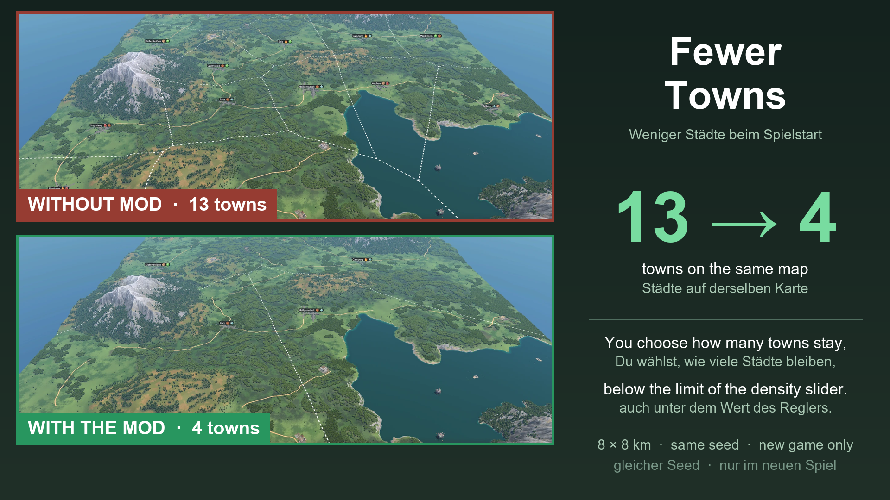

# Fewer Towns (Transport Fever 3)

**EN** | [DE](#deutsch)

**Get it in the in-game Mod Hub** (mod.io): [Fewer Towns](https://mod.io/g/transportfever3/m/fewer-towns)

A script mod for Transport Fever 3. When a new game starts, it deletes a share of the generated towns, so you can play on a map with **fewer towns than the "Town Density" slider allows** (for example 6 instead of the 11 that "Sparse" gives on a very large map).

**Please test it in a new game first, and tell me how it works for you** (see [Feedback](#feedback)).

## Why

In Transport Fever 2 the town density could be lowered in `base_config.lua`. In Transport Fever 3 the town count is decided when the map is generated in the new game dialog, with values that are fixed in the game's interface code (`maxNumberPerArea = 0.2` and the "Town Density" slider from 0.2 to 1.0). A mod cannot change that step, so this mod deletes towns after the map was created.

## How to use

1. Create a new game as usual and choose the map settings.
2. In the mod selection, activate **Fewer Towns** and open its custom parameters (gear icon).
3. Choose **Towns to keep**: 100 % (nothing changes), 75 %, 50 %, 40 %, 30 %, 20 % or 10 %.
4. Choose **Which towns are deleted**: random towns, the smallest towns first, or the largest towns first.
5. Choose **Central town**: keep it (default) or delete it too. The central town is the town closest to the middle of the map. Keeping it leaves the tutorial and its rewards working.
6. Click **Create map**. About 15 seconds after the game started, the towns are deleted. At least one town always stays.

## What to expect

- It works **only at the start of a new game**, never in a running game. Adding the mod to a savegame does nothing.
- **How old must a savegame be to stay untouched?** The mod only deletes towns while the game has run for fewer than **2000 simulation updates**. In the tests a fresh game was at 75 to 322 updates when the towns were deleted, and a savegame that had been played for a while was at 19 237 and was left alone. Roughly: a savegame in which you played for **more than about 7 minutes** (at normal speed, sooner at fast forward) is never changed. A savegame saved in the very first minutes of a new game can still be affected if you add the mod to it.
- The map preview in the new game dialog still shows the **original** number of towns.
- **Roads that connected a deleted town stay behind** as dead ends. You can remove them with the bulldozer. Removing them automatically is a possible later addition.
- Industries are not touched. Industries that stood next to a deleted town stay where they are.
- The game writes a warning `Town entity does not exist anymore` to its log for each deleted town. That is harmless.

## Install

Open the **Mod Hub** in the game, search for "Fewer Towns" and subscribe. This repository holds the source code and is the place for feedback; the mod is meant to be installed through the Mod Hub.

## How it works

- `content/mod.script.tl`: the mod parameters are handed to the game script through two fields of the base config that no longer matter after the map was generated (`locations.town.townFrequency` and `locations.town.maxNumberPerArea`; the latter carries the mode plus 3 if the central town is kept).
- `content/fewer_towns.script.tl`: a game script that waits 15 seconds, then deletes the chosen share of towns with `makeTownDestroyCmd`. It does nothing if the game is already running (`updateCount` is checked).

## Tested

Tested on Transport Fever 3, build 40408:
- A very large map with 11 towns, 50 %, random: 5 towns were deleted, 6 remained, and the game ran for several minutes without errors.
- A small map (8 × 8 km) with 13 towns, 30 %, random: 9 towns were deleted, 4 remained (see the picture above).
- The protection: an older savegame with the mod active was left unchanged.

Not tested: the other percentages and the two other modes, maps with many more towns, and the combination with other mods.

## Feedback

Please use [Issues](../../issues) for bugs and [Discussions](../../discussions) for feedback and ideas. Helpful details: game build, map size and town density, the settings of the mod, and the `stdout.txt` from your `crash_dump` folder if the game crashed.

## License

MIT, see [LICENSE](LICENSE).

---

## Deutsch

**Im Spiel über den Mod-Hub laden** (mod.io): [Fewer Towns](https://mod.io/g/transportfever3/m/fewer-towns)

Ein Script-Mod für Transport Fever 3. Beim Start eines neuen Spiels löscht er einen Teil der erzeugten Städte. So kannst du auf einer Karte mit **weniger Städten spielen, als der Regler „Städtedichte“ erlaubt** (zum Beispiel 6 statt der 11, die „Sehr dünn“ auf einer sehr großen Karte liefert).

**Bitte zuerst in einem neuen Spiel testen und mir Rückmeldung geben** (siehe [Feedback](#feedback-1)).

### Warum

In Transport Fever 2 ließ sich die Städtedichte in der `base_config.lua` senken. In Transport Fever 3 wird die Städtezahl beim Erzeugen der Karte im Neues-Spiel-Dialog festgelegt, mit Werten, die im Oberflächencode des Spiels fest eingebaut sind (`maxNumberPerArea = 0.2` und der Regler „Städtedichte“ von 0,2 bis 1,0). Ein Mod kann diesen Schritt nicht ändern, deshalb löscht dieser Mod die Städte, nachdem die Karte erzeugt wurde.

### So geht's

1. Ein neues Spiel wie gewohnt anlegen und die Karteneinstellungen wählen.
2. In der Mod-Auswahl **Fewer Towns** aktivieren und die eigenen Parameter öffnen (Zahnrad).
3. **Towns to keep** wählen: 100 % (nichts ändert sich), 75 %, 50 %, 40 %, 30 %, 20 % oder 10 %.
4. **Which towns are deleted** wählen: zufällige Städte, die kleinsten zuerst oder die größten zuerst.
5. **Central town** wählen: behalten (Standard) oder auch löschen. Die Zentralstadt ist die Stadt, die der Kartenmitte am nächsten liegt. Wenn sie bleibt, funktionieren Tutorial und seine Belohnungen weiter.
6. Auf **Karte erstellen** klicken. Etwa 15 Sekunden nach Spielstart werden die Städte gelöscht. Mindestens eine Stadt bleibt immer.

### Was du erwarten kannst

- Er wirkt **nur beim Start eines neuen Spiels**, nie in einem laufenden Spiel. Den Mod zu einem Spielstand hinzuzufügen bewirkt nichts.
- **Wie alt muss ein Spielstand sein, damit er unberührt bleibt?** Der Mod löscht Städte nur, solange das Spiel weniger als **2000 Simulationsschritte** gelaufen ist. In den Tests stand ein frisches Spiel beim Löschen bei 75 bis 322 Schritten, ein Spielstand, in dem schon eine Weile gespielt wurde, bei 19 237 und blieb unverändert. Als Faustregel: Ein Spielstand, in dem du **länger als etwa 7 Minuten** gespielt hast (bei normaler Geschwindigkeit, im Zeitraffer eher), wird nie verändert. Ein Spielstand, der in den allerersten Minuten eines neuen Spiels gespeichert wurde, kann noch betroffen sein, wenn du den Mod dazuschaltest.
- Mit eingeschaltetem **Tutorial** wird keine Stadt gelöscht. Das Tutorial braucht bestimmte Städte mit Namen, und fehlt eine, stürzt das Spiel ab.
- Die Kartenvorschau im Neues-Spiel-Dialog zeigt weiter die **ursprüngliche** Städtezahl.
- **Straßen, die zu einer gelöschten Stadt führten, bleiben als Sackgassen zurück.** Mit dem Abrisswerkzeug lassen sie sich entfernen. Ein automatisches Entfernen wäre eine mögliche spätere Ergänzung.
- Industrien bleiben unberührt. Industrien neben einer gelöschten Stadt bleiben stehen.
- Das Spiel schreibt für jede gelöschte Stadt eine Warnung `Town entity does not exist anymore` ins Log. Das ist harmlos.

### Installation

Im Spiel den **Mod-Hub** öffnen, nach „Fewer Towns“ suchen und abonnieren. Dieses Repository enthält den Quellcode und ist der Ort für Rückmeldungen. Der Mod ist dafür gedacht, über den Mod-Hub installiert zu werden.

### Getestet

Getestet mit Transport Fever 3, Build 40408:
- Sehr große Karte mit 11 Städten, 50 %, zufällig: 5 Städte wurden gelöscht, 6 blieben, und das Spiel lief mehrere Minuten ohne Fehler.
- Kleine Karte (8 × 8 km) mit 13 Städten, 30 %, zufällig: 9 Städte wurden gelöscht, 4 blieben (siehe Bild oben).
- Der Schutz: Ein älterer Spielstand mit aktivem Mod blieb unverändert.

Nicht getestet: die anderen Prozentwerte und die zwei anderen Modi, Karten mit deutlich mehr Städten und die Kombination mit anderen Mods.

### Feedback

Bitte [Issues](../../issues) für Fehler und [Discussions](../../discussions) für Rückmeldungen und Ideen nutzen. Hilfreich sind: Spiel-Build, Kartengröße und Städtedichte, die Einstellungen des Mods und die `stdout.txt` aus dem Ordner `crash_dump`, falls das Spiel abgestürzt ist.

### Lizenz

MIT, siehe [LICENSE](LICENSE).
